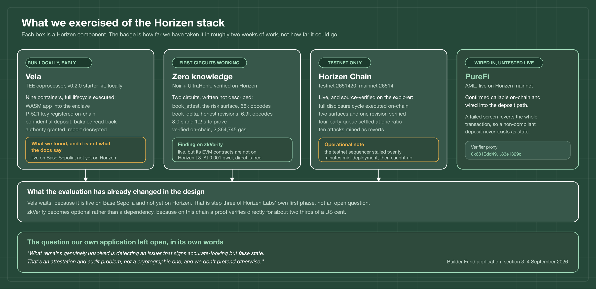

# Agama x Horizen

**Technical follow-up to our Builder Ecosystem Fund application.**
Complementary apps pool, $88,000 requested, submitted 4 September 2026.

---

## Why this repository exists

Section 3 of that application named one problem as genuinely unsolved, in these
words:

> "What remains genuinely unsolved is detecting an issuer that signs
> accurate-looking but false state. That's an attestation and audit problem, not
> a cryptographic one, and we don't pretend otherwise."

The review that came back put the same problem more sharply:

> "If the issuer signs a clean book and the loans are already bad, the TEE and
> the ZK proof still pass."

Both are the same observation, and both are correct. A trusted execution
environment attests that code ran on data. A proof attests that numbers follow
from a commitment. Neither reaches the world.

So rather than answer with more cryptography, we spent the time doing two
things: **going through Horizen's stack component by component to see what it
actually supports**, and reworking the disclosure design around what we found.

### → [`Agama x Horizen - Technical Architecture.pdf`](Agama%20x%20Horizen%20-%20Technical%20Architecture.pdf)

Twenty-one pages, and the document this repository supports.

---

## What we exercised of the Horizen stack



| Component | How far we took it | Where to check it |
| --- | --- | --- |
| **Vela** | Full v0.2.0 stack run locally. WASM app into the enclave, P-521 key registered, confidential deposit, authority granted on-chain, deanonymisation report decrypted. Live on Base Sepolia for early-access developers, not yet on Horizen | [`tee/`](tee/) |
| **Zero knowledge** | Two Noir circuits written, proven, and verified on-chain by Horizen. 3.0 s and 1.2 s to prove, 2,364,745 gas to verify | [`zk/`](zk/) |
| **Horizen Chain** | Deployed on testnet 2651420 and source-verified on the explorer. Full cycle executed on-chain | [`deployment/`](deployment/) |
| **PureFi** | Confirmed callable on mainnet, wired into the deposit path so a failed screen reverts the whole transaction | [`0x681Edd49…`](https://horizen-testnet.explorer.caldera.xyz/address/0x681Edd4906e2a0a277E2A6c394A4595f83e1329c) |
| **zkVerify** | Evaluated and set aside, with a reason | see the paper, section 2.3 |

**Two findings changed the architecture rather than confirming it.**

Vela is live on Base Sepolia for early-access developers, and **not yet on
Horizen**. Horizen Labs list the sequence themselves: Base Sepolia, then Base
mainnet, then "Deploy to Horizen testnet and mainnet". Their documentation's
limitations page still says Vela is not deployed anywhere, which is out of step
with their own product page, and the local development stack does run an
emulated enclave with plaintext keys.

So Vela leaves the Phase 1 critical path, because a dependency live on a
different chain than ours is still one we cannot ship against today. It stays
Phase 2, and Phase 2 is a bet on when a committed roadmap item reaches this
chain rather than on whether the technology works.

zkVerify is live, but its EVM contracts are not on Horizen L3, and at 0.001 gwei
a proof verifies directly on Horizen for about two thirds of a US cent. It
becomes optional rather than a dependency.

Neither conclusion is one we expected going in, and neither is in the
application we submitted.

---

## Live on Horizen testnet

Chain 2651420. All five contracts are source-verified, so the code running at
these addresses can be read rather than trusted.

| | |
| --- | --- |
| Registry | [`0x6D7C4a153C47841fE0A75C3b0a5298E1a3c9229B`](https://horizen-testnet.explorer.caldera.xyz/address/0x6D7C4a153C47841fE0A75C3b0a5298E1a3c9229B) |
| Vault | [`0x48db9A42098f8eEc6ff14D771D67cA57f3aB5651`](https://horizen-testnet.explorer.caldera.xyz/address/0x48db9A42098f8eEc6ff14D771D67cA57f3aB5651) |
| ZK verifier | [`0xb95B360324edbfd324e19196F6fF3B97E9EaA7dA`](https://horizen-testnet.explorer.caldera.xyz/address/0xb95B360324edbfd324e19196F6fF3B97E9EaA7dA) |
| Revision verifier | [`0xA3C1e81Fdadb5bd098546A4B8FBDfe4169436cF4`](https://horizen-testnet.explorer.caldera.xyz/address/0xA3C1e81Fdadb5bd098546A4B8FBDfe4169436cF4) |

```sh
./deployment/read-state.sh    # reads only, no keys, no trust in us
```

Every transaction hash is in [`deployment/`](deployment/), including ten attacks
submitted to the chain and mined as reverts.

---

## What changed in the design

The application said what stays public is "NAV, aggregate performance, vault size
and solvency proofs". The review was right that this lets a depositor check
arithmetic and not credit. The public surface is wider now, and the principle
behind it is that **confidentiality covers identity, not risk**.

| | |
| --- | --- |
| Published every attestation, proven against an on-chain commitment | position count, principal, maturity ladder, delinquency buckets, concentration, and the cash the book is contractually owed over the coming 30 days |
| Still private, and we defend it | borrower identity, negotiated terms, individual loan positions |
| Computed rather than asserted | NAV, from the proven surface and an impairment schedule fixed in code |
| Observed rather than reported | collections, because repayments settle on-chain |

The consequence is that a clean signature over a bad book still produces a valid
proof, and then misses the cash calendar it published before the period began.
The lie stops being undetectable and starts having a half-life of one payment
period.

### What this does not yet cover

The application named three confidentiality requirements. This design delivers
the third and not the first two, and the paper says so in section 7.3 rather
than leaving it to be noticed.

| Requirement | Status |
| --- | --- |
| Credit-level detail: borrowers, maturities, terms | **Delivered.** Commitments plus proofs, live on Horizen |
| Depositor positions and identities | **Not in this design.** The vault is ERC-4626, so balances are public. Needs the confidential ledger Vela provides, which we ran locally and which reaches this chain at step three of Vela's own roadmap |
| Pending redemptions, confidential until execution | **Deliberately inverted**, because the review made the opposite point. Section 9.2 resolves it: the aggregate is the run signal and belongs in public, the individual ticket is the exploitable detail and belongs in the enclave |

The paper works through all of it, along with what remains trusted and what we
do not claim.

---

## The rest of the repository

[`contracts/`](contracts/) holds a reference implementation of the disclosure
registry and the vault, with the tests behind the figures in the paper. It is
there so the architecture can be checked rather than believed, not as a finished
product: the book behind every number is synthetic, generated by
[`zk/gen.py`](zk/gen.py), and putting a real originator behind it is the work
the milestones cover.

[`FEASIBILITY.md`](FEASIBILITY.md) is Horizen measured rather than read: chain
throughput, gas, live contract addresses, and what the stack does and does not
support today.
