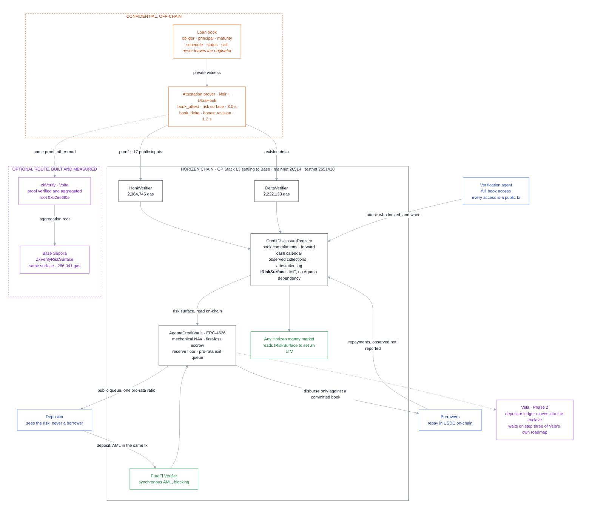

# Agama x Horizen

**Technical follow-up to our Builder Ecosystem Fund application.**

[](https://github.com/agamafinance/agama-horizen/actions/workflows/tests.yml)

---

## Why this repository exists

Section 3 of that application named one problem as genuinely unsolved, in these
words:

> "What remains genuinely unsolved is detecting an issuer that signs
> accurate-looking but false state. That's an attestation and audit problem, not
> a cryptographic one, and we don't pretend otherwise."

The review that came back put the same problem more sharply:

> "If the issuer signs a clean book and the loans are already bad, the TEE and
> the ZK proof still pass."

Both are the same observation, and both are correct. A trusted execution
environment attests that code ran on data. A proof attests that numbers follow
from a commitment. Neither reaches the world.

So rather than answer with more cryptography, we spent the time doing two
things: **going through Horizen's stack component by component to see what it
actually supports**, and reworking the disclosure design around what we found.

### → [`Agama x Horizen - Technical Architecture.pdf`](Agama%20x%20Horizen%20-%20Technical%20Architecture.pdf)

Twenty-three pages, and the document this repository supports.

> **Status of the technical work.** This is an early build, started in response
> to your review and roughly two weeks old. It is a prototype meant to test
> whether the approach holds, not a product. The book behind every figure is
> synthetic, nothing has run on mainnet, there is no originator and no depositor,
> the attestation circuit is capped at 64 positions, and none of it has been
> audited. Most of the work is still ahead.

### → [`Agama x Horizen - Traction.pdf`](Agama%20x%20Horizen%20-%20Traction.pdf)

Four pages on the business rather than the code: the supply side, the capital
committing, and the ecosystem support behind it. Pre-mainnet, with the first
vault launching in Q4.

---

## What we exercised of the Horizen stack



| Component | How far we have taken it so far | Where to check it |
| --- | --- | --- |
| **Vela** | [Full v0.2.0 stack](https://github.com/HorizenOfficial/vela-starterkit) run locally. WASM app into the enclave, P-521 key registered, confidential deposit, authority granted on-chain, deanonymisation report decrypted. Live on Base Sepolia for early-access developers, not yet on Horizen | [`tee/`](tee/) |
| **Zero knowledge** | Two [Noir](https://noir-lang.org/) circuits written, proven, and verified on-chain by Horizen. 3.0 s and 1.2 s to prove, 2,364,745 gas to verify. `zk/prove.sh` regenerates the deployed Solidity verifiers byte for byte | [`zk/`](zk/) |
| **Horizen Chain** | Deployed on testnet 2651420 and source-verified on the explorer. Full cycle executed on-chain | [`deployment/`](deployment/) |
| **PureFi** | Confirmed callable on mainnet, wired into the deposit path so a failed screen reverts the whole transaction | [`0x681Edd49…`](https://horizen.calderaexplorer.xyz/address/0x681Edd4906e2a0a277E2A6c394A4595f83e1329c) |
| **[zkVerify](https://docs.zkverify.io/)** | Proof verified and aggregated by zkVerify on Volta. Consumer deployed and source-verified on Base Sepolia, where it recomputes zkVerify's statement on-chain and admits the surface for 266,041 gas against 2,364,745 direct | [`zk/zkverify/`](zk/zkverify/), [`deployment/base-sepolia.md`](deployment/base-sepolia.md) |

**Two findings have already changed the architecture rather than confirming it.**

Vela is live on Base Sepolia for early-access developers, and **not yet on
Horizen**. Horizen Labs list the sequence themselves: Base Sepolia, then Base
mainnet, then "Deploy to Horizen testnet and mainnet". Their documentation's
limitations page still says Vela is not deployed anywhere, which is out of step
with their own product page, and the local development stack does run an
emulated enclave with plaintext keys.

So Vela leaves the Phase 1 critical path, because a dependency live on a
different chain than ours is still one we cannot ship against today. It stays
Phase 2, and Phase 2 is a bet on when a committed roadmap item reaches this
chain rather than on whether the technology works.

zkVerify verified our proof and published the aggregation. But no domain relays a
root to an EVM chain: on Volta and on mainnet alike, `hp_dispatch::Destination`
has one variant and it is `None`, so that hop runs on a relayer zkVerify
operates rather than on anything an application configures. And there is no
aggregation contract on Horizen L3 at all. At 0.001 gwei a proof also verifies directly here
for about two thirds of a cent, so the order of magnitude the route saves is
worth a tenth of a cent. It becomes an option rather than a dependency, and the
integration is built so the choice can be revisited on a chain where the
arithmetic reverses.

Neither conclusion is one we expected going in, and neither is in the
application we submitted.

---

## Live on Horizen testnet

Chain 2651420. All five contracts are source-verified, so the code running at
these addresses can be read rather than trusted.

| | |
| --- | --- |
| Registry | [`0x658A4745c517daa9FA7e221506e5d3f7a352554F`](https://horizen-testnet.explorer.caldera.xyz/address/0x658A4745c517daa9FA7e221506e5d3f7a352554F) |
| Vault | [`0xa5Af4F297fF72855e778E70701de7f1dd6B8bEc0`](https://horizen-testnet.explorer.caldera.xyz/address/0xa5Af4F297fF72855e778E70701de7f1dd6B8bEc0) |
| ZK verifier | [`0x50E753B8060028186d9E090461A9Ff8b6407d1A2`](https://horizen-testnet.explorer.caldera.xyz/address/0x50E753B8060028186d9E090461A9Ff8b6407d1A2) |
| Revision verifier | [`0x00127EFEfac82972E112D92298CfDB9C5E45A71C`](https://horizen-testnet.explorer.caldera.xyz/address/0x00127EFEfac82972E112D92298CfDB9C5E45A71C) |

```sh
./deployment/read-state.sh    # reads only, no keys, no trust in us
```

Every transaction hash is in [`deployment/`](deployment/), including ten attacks
submitted to the chain and mined as reverts.

Two things here are reproducible end to end rather than asserted. `forge test`
in [`contracts/`](contracts/) runs forty-nine tests against a pinned fork of
Horizen mainnet. And `./prove.sh` in [`zk/`](zk/) rebuilds both circuits and
regenerates `HonkVerifier.sol` and `DeltaVerifier.sol` byte for byte identical
to the contracts source-verified at the addresses above, so `git status` stays
clean after a full rebuild. That is a complete chain from circuit source to
on-chain bytecode, on a laptop, in one command.

---

## What changed in the design

The application said what stays public is "NAV, aggregate performance, vault size
and solvency proofs". The review was right that this lets a depositor check
arithmetic and not credit. The public surface is wider now, and the principle
behind it is that **confidentiality covers identity, not risk**.

| | |
| --- | --- |
| Published every attestation, proven against an on-chain commitment | position count, principal, maturity ladder, delinquency buckets, concentration, and the cash the book is contractually owed over the coming 30 days |
| Still private, and we defend it | borrower identity, negotiated terms, individual loan positions |
| Computed rather than asserted | NAV, from the proven surface and an impairment schedule fixed in code |
| Observed rather than reported | collections, because repayments settle on-chain |

The consequence is that a clean signature over a bad book still produces a valid
proof, and then misses the cash calendar it published before the period began.
The lie stops being undetectable and starts having a half-life of one payment
period.

### What this does not yet cover

The application named three confidentiality requirements. This design delivers
the third and not the first two, and the paper says so in section 7.3 rather
than leaving it to be noticed.

| Requirement | Status |
| --- | --- |
| Credit-level detail: borrowers, maturities, terms | **Working prototype.** Commitments plus proofs, running on Horizen testnet |
| Depositor positions and identities | **Not started.** The vault is ERC-4626, so balances are public. Needs the confidential ledger Vela provides, which we ran locally and which reaches this chain at step three of Vela's own roadmap |
| Pending redemptions, confidential until execution | **Deliberately inverted for now**, because the review made the opposite point. Section 9.2 resolves it: the aggregate is the run signal and belongs in public, the individual ticket is the exploitable detail and belongs in the enclave |

The paper works through all of it, along with what remains trusted and what we
do not claim.

---

## The rest of the repository

[`contracts/`](contracts/) holds an early reference implementation of the
disclosure registry and the vault, with the tests behind the figures in the
paper. It is there so the architecture can be checked rather than believed, and
it is deliberately not a product: the book behind every number is synthetic,
generated by [`zk/gen.py`](zk/gen.py), and putting a real originator behind it is
the work the milestones cover.

[`architecture/FEASIBILITY.md`](architecture/FEASIBILITY.md) is Horizen measured rather than read: chain
throughput, gas, live contract addresses, and what the stack does and does not
support today.
